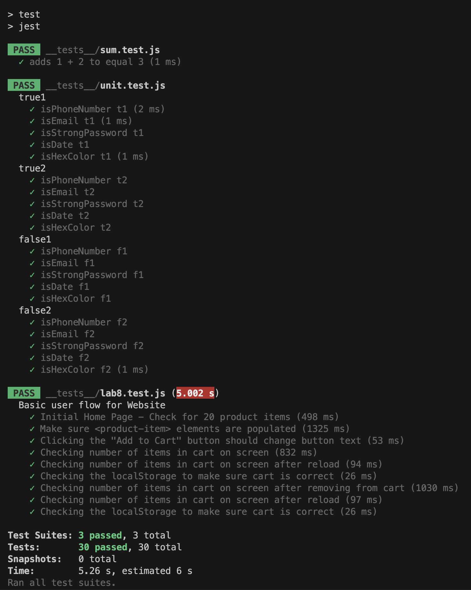

# CSE110 Lab 8
- Name: Xiaonan Fu

1. The automated tests should be in github actions, because the purpose of automated tests is to test the old functionality that was usable before the new code was added. Since they are not the current focus of the developer, it is not necessary to run them locally. 
2. Would you use an end to end test to check if a function is returning the correct output? NO. 
3. Message feature is not appropriate for unit testing because it includes multiple functions and is not a single unit.
4. Yes, the max message lenght is good for unit testing because it does not need context from other functions to run.

## Screenshots
